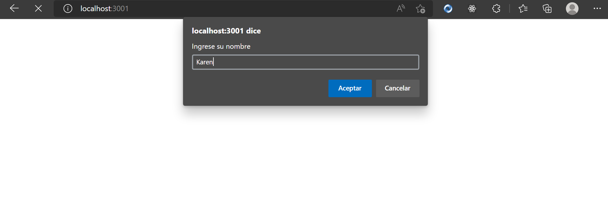
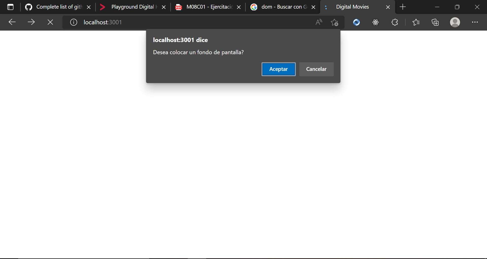
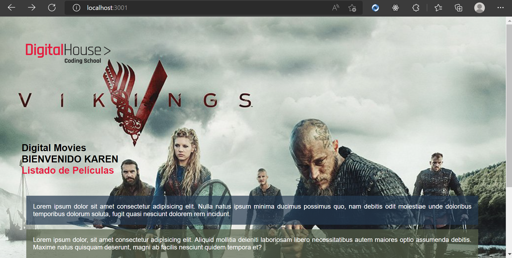
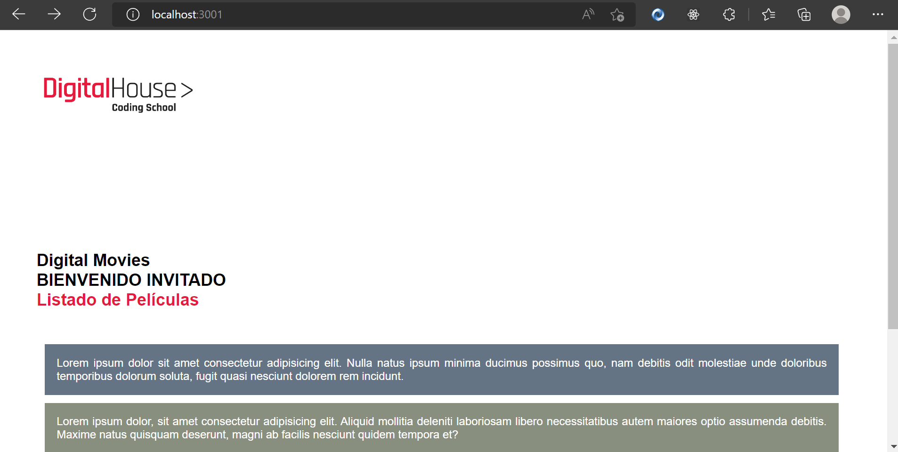

### Manipulando elementos con JS
#### En esta práctica implementaremos JavaScript del lado del frot-end. Esto es especialmente importante cuando queremos que nuestro sitio tenga dinamismo y características interactivas. 
#### Para hacer lo anterior, tenemos que manipular elementos del DOM.
#### 👉 ¿Qué es el DOM? 👈
#### El DOM se refiere al Document Object Model o el modelo de objeto de documento. Esto es una interfaz de programación que dispone a los desarrolladores un control preciso sobre la estructura del documento HTML. Las funciones que proporciona el DOM permiten añadir, eliminar, modificar y reemplazar cualquier nodo de cualquier documento de forma sencilla.
#### Algunos ejemplos
#### Una vez cargado el sitio, se ve lo siguiente:

#### Ingreso mi nombre y aparece otro alert:

#### Escribiendo el nombre y aceptando el modo oscuro, el resultado es el siguiente: 

#### Si lo NO escribimos el nombre y NO elegimos el modo oscuro, el resultado será:
